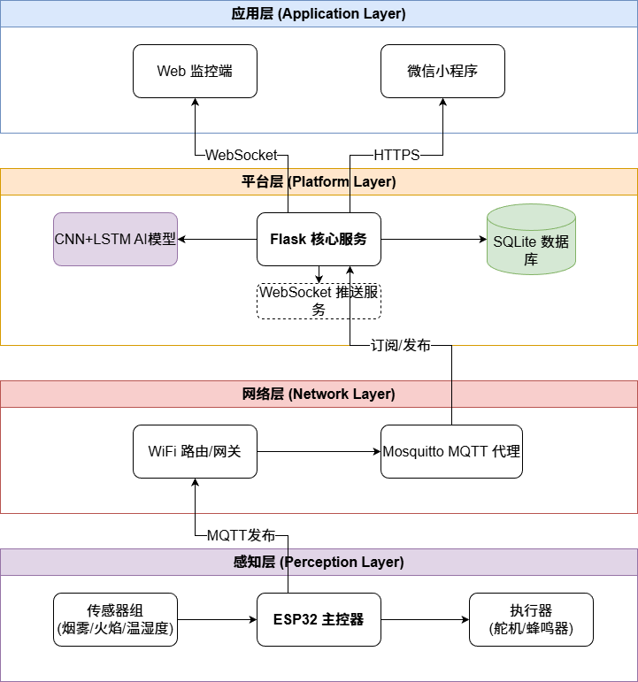
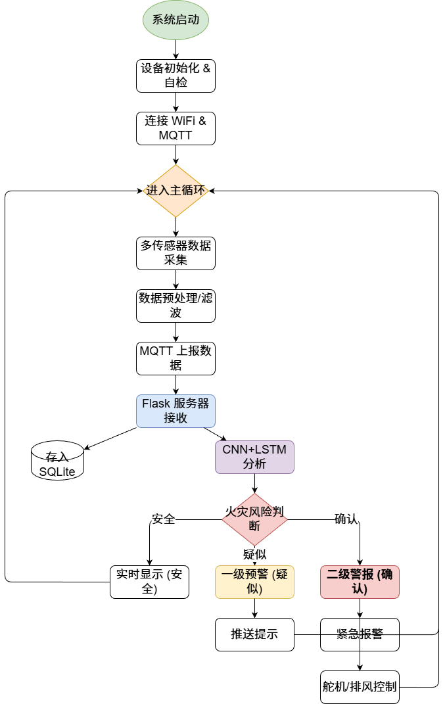
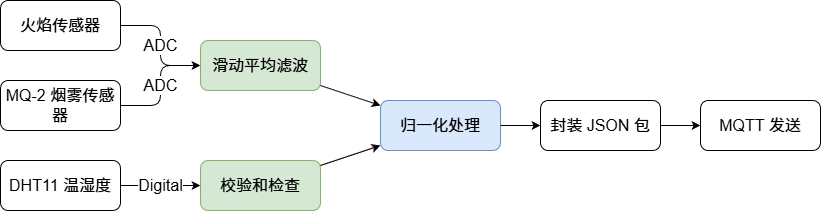
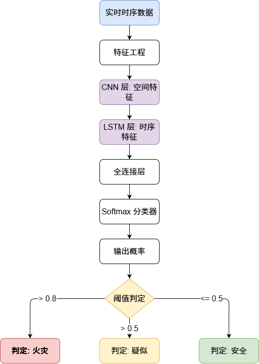

# 基于 FLASK 框架的 AI 低误报智能火灾预警系统概要设计文档

## 一、 系统概述

### 1.1 系统开发背景与意义
在工业生产、商业建筑及居民住宅等各类场景中，火灾事故的发生往往会带来严重的人员伤亡与财产损失。传统火灾预警系统多依赖单一传感器检测，易受环境干扰，存在误报率高、预警滞后等问题，不仅降低了预警系统的可信度，还可能导致相关人员对预警信息产生麻痹心理，延误火灾初期的扑救时机。

随着人工智能技术与物联网的快速发展，融合多维度数据感知与智能分析的预警系统成为解决传统问题的关键。本系统基于 FLASK 框架开发，整合多类型传感器数据采集、AI 智能算法分析、实时通信与远程监控功能，构建 AI 低误报智能火灾预警系统。该系统能够通过多传感器数据融合与 AI 模型精准识别火灾特征，大幅降低误报率；同时实现火灾隐患的实时监测、智能预警与远程管控，为火灾预防与应急处置提供高效支持，保障人员生命与财产安全，具有重要的实际应用价值与社会意义。

### 1.2 软件基本信息与运行环境
根据软著申报要求，本系统的核心配置与开发环境如下：

| 项目 | 详细描述 |
| :--- | :--- |
| **软件名称** | 基于 FLASK 框架的 AI 低误报智能火灾预警系统 |
| **主要功能** | 本软件基于 FLASK 框架开发，整合多类型传感器数据采集模块与 CNN+LSTM 深度学习 AI 分析算法，精准实现火灾风险智能识别；支持两级梯度预警信息推送，可通过 Web 端、微信小程序双终端实时监控火灾环境数据，同时提供历史数据查询、趋势分析功能，提升消防安全管控效率。 |
| **开发目的** | 解决传统火灾预警误报率高、预警滞后问题，实现火灾隐患精准管控。 |
| **面向领域** | 消防安全、智能安防 |
| **编程语言** | Python、SQL |
| **源程序量** | 约 3000 行 |
| **开发的硬件环境** | Intel Core i5及以上处理器、8GB及以上内存、50GB及以上硬盘空间的PC机 |
| **运行的硬件环境** | 云服务器（CPU 2核及以上、内存4GB及以上）或同开发配置的PC机 |
| **开发操作系统** | Windows 10/11 64位、Ubuntu 20.04 LTS |
| **开发工具** | PyCharm 2022+、Python 3.8-3.10、Flask 2.0+、SQLite 3.x |
| **运行平台** | Windows Server 2019、Ubuntu 20.04 LTS、CentOS 7 |
| **支持软件** | Python 3.8-3.10、Flask 2.0+、SQLite 3.x、Chrome 90+浏览器 |

## 二、 系统开发关键技术

本系统采用“感知层-网络层-平台层-应用层”的四层架构设计，后端核心框架为 FLASK，结合多传感器数据采集、AI 算法分析、实时通信等关键技术，保障系统的稳定性、精准性与易用性。

### 2.1 FLASK 框架
FLASK 作为一款基于 Werkzeug WSGI 工具包与 Jinja2 模板引擎的轻量级 Python Web 框架，具备灵活、简洁、易扩展的核心特点。在本系统中承担着后端核心的重要职责，不仅能提供 RESTful API 接口以实现前端与后端、感知层与平台层的数据交互，还能整合 SQLite 数据库完成传感器数据、预警记录、用户信息等数据的存储与管理，同时支持 WebSocket 实时通信协议保障传感器数据与预警信息的实时推送。

### 2.2 多传感器数据采集技术
多传感器数据采集技术是系统获取火灾相关数据的基础。系统感知层整合了多种高精度传感器以实现多维度数据的全面采集：
*   **火焰传感器**：检测环境中火焰辐射信号；
*   **MQ-2 烟雾传感器**：监测烟雾浓度，区分正常烟雾与火灾烟雾；
*   **DHT11 温湿度传感器**：采集环境温湿度，排除因湿度异常导致的误报；
*   **BH1750 光照传感器 & 声音传感器**：辅助判断光照突变及异常声音（如爆炸声）。
所有传感器通过 ESP32 主控制器进行数据汇总与初步去噪处理。

### 2.3 AI 智能算法技术 (CNN+LSTM)
AI 智能算法技术是实现系统低误报的核心。系统采用 **CNN（卷积神经网络）** 与 **LSTM（长短期记忆网络）** 融合模型：
*   **CNN**：用于提取数据中的空间特征（如烟雾浓度的瞬间突变特征）；
*   **LSTM**：用于处理时间序列特征（如温度随时间的持续上升趋势）。
该模型对预处理后的数据进行推理，快速完成火灾风险判断与预警等级评估，误报率控制在 3% 以下。

### 2.4 网络通信技术
*   **MQTT 协议**：用于感知层 ESP32 与服务器之间的低功耗、高可靠数据传输，支持弱网环境下的稳定上报。
*   **WebSocket 协议**：实现 platform 层与 Web/小程序应用层的全双工通信，确保报警信息毫秒级推送到用户终端。

### 2.5 数据库技术
采用轻量级 **SQLite** 数据库，无需单独部署，适合本系统的中小型数据存储需求。主要存储传感器实时数据、报警历史记录及设备状态信息。

## 三、 系统核心需求

### 3.1 数据采集与预处理需求
支持火焰、烟雾、温湿度、光照、声音等多传感器的数据实时采集，且采集频率可灵活配置（默认 1 次/秒）。具备完善的数据预处理功能，通过滤波算法降噪、异常值剔除，保障采集数据的准确性。

### 3.2 AI 智能识别与预警需求
聚焦于火灾识别的精准性。首先需基于 AI 模型实现火灾信号的精准识别；其次支持预警等级的清晰划分（一级预警-疑似，二级预警-确认），不同等级对应不同的报警方式（弹窗、蜂鸣器、短信等）。

### 3.3 实时监控与远程控制需求
在 Web 界面与微信小程序上实时展示各关键数据图表、设备运行状态及报警记录。支持远程控制相关设备，如远程复位报警状态、启动排风设备等。

## 四、 系统设计

### 4.1 系统总体架构设计
系统采用物联网四层架构设计，各层职责明确、协同工作。

*   **感知层**：ESP32 主控与各类传感器，负责现场数据采集与执行控制。
*   **网络层**：WiFi 模块与 MQTT Broker，负责数据透传。
*   **平台层**：Flask 后端、AI 分析引擎与 SQLite 数据库，负责业务逻辑与存储。
*   **应用层**：Web 监控端与微信小程序，负责交互与展示。

**系统物理与逻辑架构图：**

### 4.2 系统核心业务流程设计
为了更清晰地展示系统从数据采集到报警处置的全过程，设计如下核心业务流程：

1.  **初始化阶段**：设备上电自检，建立 MQTT 连接。
2.  **采集分析阶段**：周期性采集数据，经 AI 模型推理计算火灾概率。
3.  **决策响应阶段**：根据概率值判定安全、警告或火警，并执行相应动作。

**系统核心业务流程图：**

### 4.3 系统模块详细设计

#### 4.3.1 数据采集与预处理模块
数据采集与预处理模块承担数据获取与标准化的核心职责。ESP32 主控制器通过 GPIO 和 ADC 接口连接各传感器，采用滑动平均滤波算法消除随机干扰，并将原始电压值转换为标准物理量（如摄氏度、百分比）。

**数据采集流程图：**

#### 4.3.2 AI 智能识别与预警模块
AI 智能识别与预警模块是实现火灾精准预警的关键。系统启动时自动加载训练好的 CNN+LSTM 深度学习模型。

*   **输入**：最近 10 个时间步长的多维传感器数据序列。
*   **处理**：CNN 提取各维度数据间的关联特征，LSTM 捕捉数据随时间变化的趋势特征。
*   **输出**：当前时刻的火灾概率值（0-1）。

**AI 模块处理逻辑图：**

### 4.4 数据库设计

#### 4.4.1 数据库设计概述
本系统数据库采用 SQLite，围绕“数据采集-智能分析-预警处置”的核心业务流程，设计三大核心数据表。

#### 4.4.2 主要的数据表结构

**(1) sensor_data (传感器数据表)**
记录了实时传感器读数的信息，ID 为主键。

| 字段名 | 类型 | 长度 | 字段注释 |
| :--- | :--- | :--- | :--- |
| id | INTEGER | - | 主键 |
| device_id | VARCHAR | 50 | 关联设备 ID |
| flame_value | INTEGER | - | 火焰传感器数值 |
| smoke_value | INTEGER | - | 烟雾传感器数值 |
| temperature | REAL | - | 温度值 |
| humidity | REAL | - | 湿度值 |
| alert_status | BOOLEAN | - | 预警状态 |
| timestamp | DATETIME | - | 数据采集时间 |

**(2) alert_history (报警历史表)**
记录了所有报警事件的信息，用于历史追溯。

| 字段名 | 类型 | 长度 | 字段注释 |
| :--- | :--- | :--- | :--- |
| id | INTEGER | - | 主键 |
| device_id | VARCHAR | 50 | 关联设备 ID |
| alert_type | VARCHAR | 20 | 报警类型(Fire/Warning) |
| location | VARCHAR | 100 | 报警位置 |
| timestamp | DATETIME | - | 报警发生时间 |
| resolved | BOOLEAN | - | 报警状态 |

**(3) device_info (设备信息表)**
记录了设备注册的信息，用于设备管理。

| 字段名 | 类型 | 长度 | 字段注释 |
| :--- | :--- | :--- | :--- |
| id | INTEGER | - | 主键 |
| device_id | VARCHAR | 50 | 设备唯一编号 |
| location | VARCHAR | 200 | 安装位置 |
| status | VARCHAR | 20 | 设备状态 |
| last_seen | DATETIME | - | 设备最后在线时间 |

## 五、 使用说明

### 5.1 使用说明

#### 5.1.1 主机统计
Web 主机统计界面展示了当前系统的核心指标，包括设备在线数、今日报警数及 AI 分析评分。
*(图 5-1 web 主机统计图)*

#### 5.1.2 设备历史数据
支持按时间范围、设备 ID 查询历史传感器数据，并以折线图形式展示变化趋势。
*(图 5-7 Web 设备历史数据设备列表图)*

#### 5.1.3 从机数据监控
展示从机（Slave）设备的实时状态，确保覆盖范围内的所有节点工作正常。
*(图 5-10 Web 从机统计图)*

#### 5.1.4 AI 数据分析建议页面
AI 分析模块会根据近期数据生成安全报告，给出维护建议（如“建议检查MQ-2传感器灵敏度”）。
*(图 5-15 Web 设备列表图)*